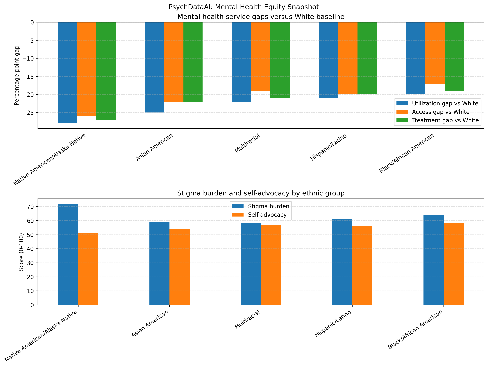

# PsychDataAI

[](https://www.python.org/)
[](https://www.sqlite.org/)
[](https://matplotlib.org/)

PsychDataAI is a behavioral health analytics portfolio project that uses Python, SQL, and data visualization to explore mental health disparities across racial and ethnic groups. The project is designed to show how data can be used to examine service utilization, access to care, treatment patterns, stigma, and self-advocacy in behavioral health.

## Project purpose
This project demonstrates how data analysis can support behavioral health equity research by combining:
- Python for data processing and visualization
- SQLite and SQL for structured analysis
- public-health-inspired storytelling around stigma, barriers, and disparities

## Technologies used
- Python 3.9+
- SQLite for local database storage
- SQL queries for analysis
- Matplotlib for chart creation

## Project structure
- [.vscode/main.py](.vscode/main.py) — main analysis script
- [psychdataai.db](psychdataai.db) — SQLite database created by the script
- [psychdataai_ethnic_comparison.png](psychdataai_ethnic_comparison.png) — generated chart
- [employer_review](employer_review) — packaged employer-facing version
- [github_repo](github_repo) — GitHub-ready portfolio materials

## Sample visualization


## Run locally
```bash
/Users/kay/Documents/.venv/bin/python .vscode/main.py
```

## Data sources to consider for future expansion
To strengthen this project for a professional portfolio, I plan to incorporate reliable public datasets from:
- SAMHSA — Substance Abuse and Mental Health Services Administration
- NIMH — National Institute of Mental Health
- CDC — Centers for Disease Control and Prevention
- U.S. Census Bureau — demographic and population context

These sources can be used to replace the current illustrative values with real-world behavioral health statistics and improve the credibility of the analysis.

## Notes
This project currently uses illustrative values for demonstration purposes, but it is structured so it can be expanded into a stronger, data-driven portfolio project with real public datasets.
